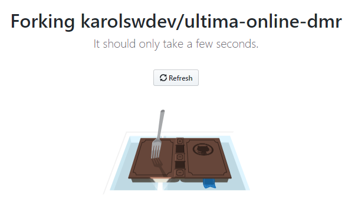
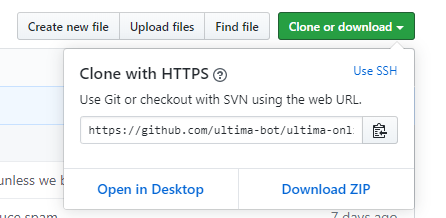
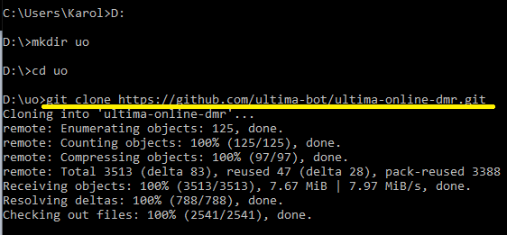
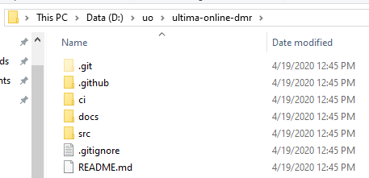

# Pomoc w tworzeniu Dream Masters: Revolution

Dokument ten opisze wszystkie kroki potrzebne do pomocy w edytowaniu plików shardu Dream Masters: Revolution.

## Podstawy

Jeśli chcesz poznać więcej o samym systemie Git, polecam lekturę [tego](https://rogerdudler.github.io/git-guide/index.pl.html) artykułu.

Wprowadza on w bardzo zrozumiały i przystępny sposób w zagadnienia oraz filozofię Gita.

## Instalacja oprogramowania oraz test

Jeśli działasz na Linuksie, git już prawdopodobnie jest dla Ciebie zainstalowany.

Na Windowsie, polecam zainstalowanie [Git Basha](https://git-scm.com/download/win) - najlepiej instalując według sugerowanych ustawień.

Po zainstalowaniu Git Basha otwórz wiersz poleceń (*cmd.exe*) i wpisz *git version*

```bash
git version 2.17.1.windows.2
```
^ Tak powinna wyglądać odpowiedź na tę komendę.

### Pierwsze użycie Git

* Założ konto na [GitHub](https://github.com/join?source=header-home).

* Zaloguj się na swoje konto w GitHub.

* Stwórz swoją kopię (fork) [naszego repozytorium](https://github.com/karolswdev/ultima-online-dmr), klikając na przycisk *Fork*.

^ Ten krok tworzy kopię, która *śledzi* główne repozytorium naszego shardu. Dzięki temu będziesz mógł zawsze edytować najnowszą wersję naszego shardu.




* Sklonuj repozytorium, aby sklonować repozytorium zrób następujące rzeczy:

    * Wejdź na swoją kopię *fork*

    * Kliknij na **Clone or download** 

    

    * Skopiuj cały adres

    * Otwórz cmd i skieruj się do folderu w którym chcesz trzymać kopię DMR za pomocą komend ``cd``

    * Wpisz ``git clone <skopiowany-adres>``

    

    * Na Twoim dysku teraz będziesz miał kopię DMR w wybranej lokalizacji

    

    * Dodaj upstream 
        * przejdź do orginalnego źrudła i skopiuj link z ``Clone or download``. Następnie w cmd wpisz:
    ````

    git remote add upstream git://github.com/karolswdev/ultima-online-dmr.git

    ````
    * Aktualizuj Upstream: 
    ````
    git fetch upstream
    ````
    * Scal upstream: 
    ````
    git merge upstream/develop develop
    ````
    Powinno pojawić się:
    ````
        Updating 0ff944e..74e0e05
        Fast-forward
        .gitignore                                         |    4 +-
        CODEOWNERS                                         |    1 +
        CONTRIB_pl.md                                      |  155 +
        README.md                                          |    2 +-
        ci/1-docker-hub-login.sh                           |    5 +-
        docs/img/change.png                                |  Bin 0 -> 8448 bytes

    ````
    * Sprawdź czy masz aktualną bazę 
    ````
    git rebase upstream/develop
    ````
    !! Za każdym razem przed rozpoczęciem pracy "Aktualizuj i scal" upstream. 

### Pierwsze zmiany

Ten krótki dział wytłumaczy Ci jak wprowadzać zmiany na główne repozytorium. W tym przypadku będziemy zmieniali plik *npcdesc.cfg* zawierający definicje mobów.

⚠️ **ZAWSZE STOSUJ TE KROKI, W TEN SPOSÓB NIGDY NIE BĘDZIESZ MIAŁ KONFLIKTÓW Z PLIKAMI EDYTOWANYMI PRZEZ INNE OSOBY** ⚠️

* Otwórz cmd i znajdź się w folderze swojej kopii DMR

* Aby upewnić się, że jesteś w odpowiednim folderze, w cmd wpisz ``git status``

```bash
On branch develop
Your branch is up to date with 'origin/develop'.

nothing to commit, working tree clean
```

^ tak powinna wyglądać odpowiedź na tę komendę, jeśli odpowiedź to ``fatal: not a git repository`` to znaczy, że nie jesteś w odpowiednim katalogu. Użyj komendy ``cd`` aby się do niego dostać.

* Upewnij się, że jestes na branch ``origin/develop``, to bardzo ważne, gdyż jest to podstawowy branch.

* Wpisz ``git checkout develop``

* Wpisz ``git pull``

^ ta komenda dociągnie wszelkie zmiany na branchu ``origin/develop``

* Następnie przejdź do edytowania jakiegokolwiek pliku w folderze, w tym przypadku otwórzmy npcdesc.cfg i zmieńmy coś małego


* W tym przypadku zmieniliśmy prędkość biegu NPC Baku z 212 na **213**.

* Zapisz plik

* Ponownie w cmd wpisz komendę ``git status`` aby sprawdzić, czy Git widzi nasze zmiany

```bash
On branch develop
Your branch is up to date with 'origin/develop'.

Changes not staged for commit:
  (use "git add <file>..." to update what will be committed)
  (use "git checkout -- <file>..." to discard changes in working directory)

        modified:   src/config/npcdesc.cfg

no changes added to commit (use "git add" and/or "git commit -a")
```

^ Odpowiedź powinna zawierać pliki, które zmieniliśmy. Tu widzimy, że npcdesc.cfg jest zmieniony i jest to rozpoznane.

* ⚠️ Następnie, zmieńmy branch, tak, aby nie zmieniać develop. Zmiana **develop** jest zakazana i zarezerwowana tylko dla administratorów. **develop** zmieniamy poprzez Pull Request (o tym dalej) ⚠️

    * Branch, który stworzymy powinien zawierać ogólne informacje o tym, jakie zawiera w sobie zmiany. Jeśli poprawiamy błąd, najlepiej prefiksować go nazwą **bugfix/**, jeśli dodajemy nowe funkcjonalności, najlepiej prefiksować go nazwą **feature/**.

    * W naszym przypadku, przyjmijmy, że poprawiamy błąd, zatem nazwijmy nas branch tak: **bugfix/fix-baku-speed**

* W cmd, wpisz komendę ``git checkout -b <nazwa-branchu>``, w tym przypadku ``git checkout -b bugfix/fix-baku-speed``

```bash
Switched to a new branch 'bugfix/fix-baku-speed'
M       src/config/npcdesc.cfg
```

* Jeśli dodałeś nowe pliki, a nie tylko edytowałeś istniejące, wpisz ``git add .`` (ważna jest kropka) doda to również wszystkie nowe pliki do Gita.

* Następnie, stwórzmy commita, commit to paczka zmian. 

* ``git commit -am "<wiadomosc, ktora opisze co konkretnie zmieniamy>"``, w naszym przypadku ``git commit -am "Zmieniono predkosc Baku z 212 do 213, bo byl za wolny"``

* Jeśli pojawi się następujący komunikat:

    ````
     *** Please tell me who you are.
    
        Run

        git config --global user.email "you@example.com"
        git config --global user.name "Your Name"  
    ````

Należy wprowadzić swój e-mail oraz Imię/pseudonim do Gita wpisując komendy:

    `` git config --global user.email " twoj-email@gmail.com"
       git config --global user.name "Imię/pseudonim" ``

* Teraz jesteśmy gotowi na to, aby wrzucić nasze lokalne zmiany w chmure. Aby to zrobić, wpisz następującą komendę w cmd:

    * ``git push --set-upstream origin bugfix/fix-baku-speed``

```bash
Counting objects: 5, done.
Delta compression using up to 8 threads.
Compressing objects: 100% (5/5), done.
Writing objects: 100% (5/5), 560 bytes | 560.00 KiB/s, done.
Total 5 (delta 4), reused 0 (delta 0)
remote: Resolving deltas: 100% (4/4), completed with 4 local objects.
remote:
remote: Create a pull request for 'bugfix/fix-baku-speed' on GitHub by visiting:
remote:      https://github.com/ultima-bot/ultima-online-dmr/pull/new/bugfix/fix-baku-speed
remote:
To https://github.com/ultima-bot/ultima-online-dmr.git
 * [new branch]      bugfix/fix-baku-speed -> bugfix/fix-baku-speed
Branch 'bugfix/fix-baku-speed' set up to track remote branch 'bugfix/fix-baku-speed' from 'origin'.
```

* Zwróc uwagę, że komunikat zawiera od razu link do tego, aby utworzyć Pull Request. Skopiuj ten link i wklej go w przeglądarke.

* Możesz wpisać więcej informacji na temat swoich zmian oraz rownież przejrzeć je na samej stronie. Gdy wszystko jest gotowe, naciśnij na przycisk Create Pull Request

* Pull Request musi być zatwierdzony przez administratora shardu, aby został wgrany w develop.